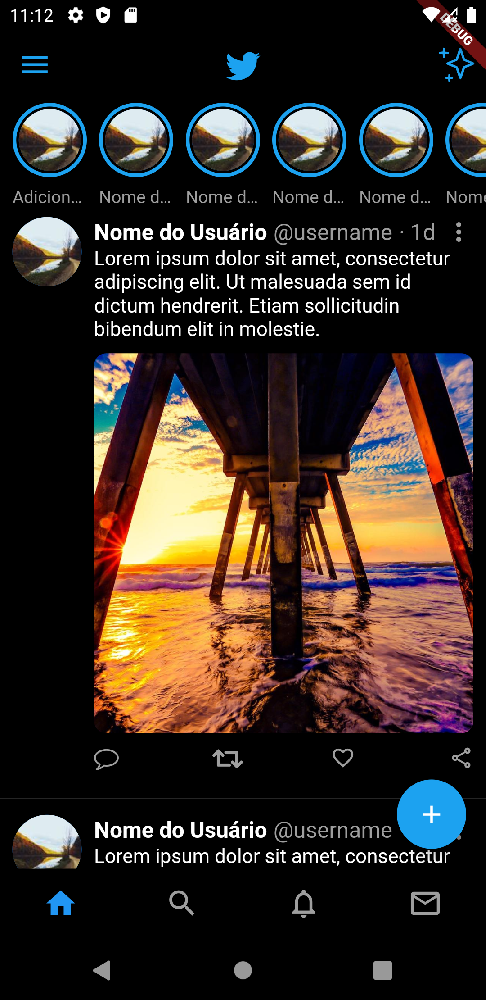

# Flutter SpeedCoding - Twitter

Este projeto visa reproduzir a interface da tela inicial do aplicativo Twitter.

Como sempre, não há nenhum patrocínio envolvido e nenhum investimento externo de qualquer forma. O propósito deste repositório é puramente voltado para estudos.

|  |  |
| ------------------------------------------------------ | --------------------------------------------------------- |
| Original                                               | Resultado                                                 |

## Getting Started

- Clonar o projeto
- Executar o comando `flutter pub get`
- Rodar o projeto
